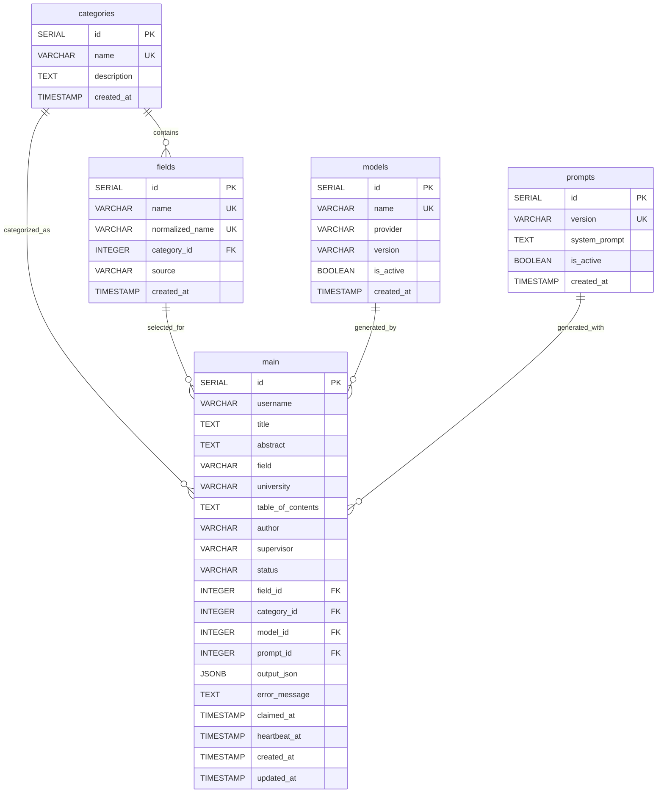

# Entity Relationship Diagram

```mermaid
erDiagram
    categories ||--o{ fields : "contains"
    categories ||--o{ main : "categorized_as"
    fields ||--o{ main : "selected_for"
    models ||--o{ main : "generated_by"
    prompts ||--o{ main : "generated_with"

    categories {
        SERIAL id PK
        VARCHAR name UK
        TEXT description
        TIMESTAMP created_at
    }

    fields {
        SERIAL id PK
        VARCHAR name UK
        VARCHAR normalized_name UK
        INTEGER category_id FK
        VARCHAR source
        TIMESTAMP created_at
    }

    models {
        SERIAL id PK
        VARCHAR name UK
        VARCHAR provider
        VARCHAR version
        BOOLEAN is_active
        TIMESTAMP created_at
    }

    prompts {
        SERIAL id PK
        VARCHAR version UK
        TEXT system_prompt
        BOOLEAN is_active
        TIMESTAMP created_at
    }

    main {
        SERIAL id PK
        VARCHAR username
        TEXT title
        TEXT abstract
        VARCHAR field
        VARCHAR university
        TEXT table_of_contents
        VARCHAR author
        VARCHAR supervisor
        VARCHAR status
        INTEGER field_id FK
        INTEGER category_id FK
        INTEGER model_id FK
        INTEGER prompt_id FK
        JSONB output_json
        TEXT error_message
        TIMESTAMP claimed_at
        TIMESTAMP heartbeat_at
        TIMESTAMP created_at
        TIMESTAMP updated_at
    }
```
